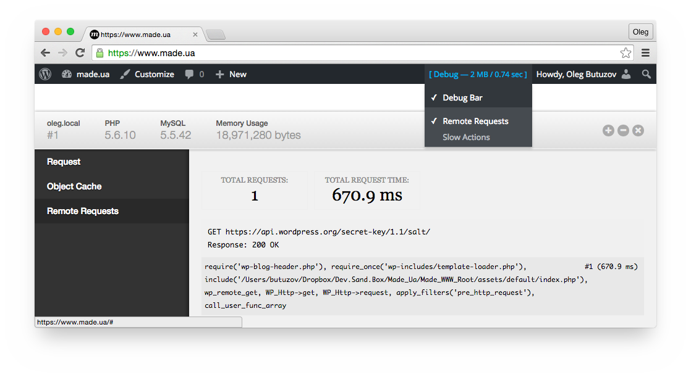

# Debug Bars Manager

> one bar to rule them all.

This is WordPress Debug Bar related Plugin, it doesn't provide any [additional debug bar panel](https://wordpress.org/plugins/tags/debug-bar), but instead it allows you to enjoy [Debug Bar](https://wordpress.org/plugins/debug-bar/)  experience.

## Features

* Allows to save debug bar UI state, during reloads.
* Allows to keep only some of the Debug Bars active, while you working with them.

## Install

1. Download [Zip Archive](https://github.com/butuzov/Debug-Bars-Manager/archive/master.zip)
1. Unzip to Plugin Directory of your wordpress site.
1. Activate Plugin at backend.
1. Download and Debug Bar and Additional Bars into plugin directory.
1. Check top right admin bar menu Debug.

## Todo
- [ ] Write tests.
- [ ] Change way it works with debug Bars
  - [ ] Move All Debug Bars to general plugins directory.
  - [ ] Allow to download bars within Debug Bars Manager plugin.
  - [ ] Debug Bars Boilerplate.
  - [ ] Debug Bars Custom Urls.
